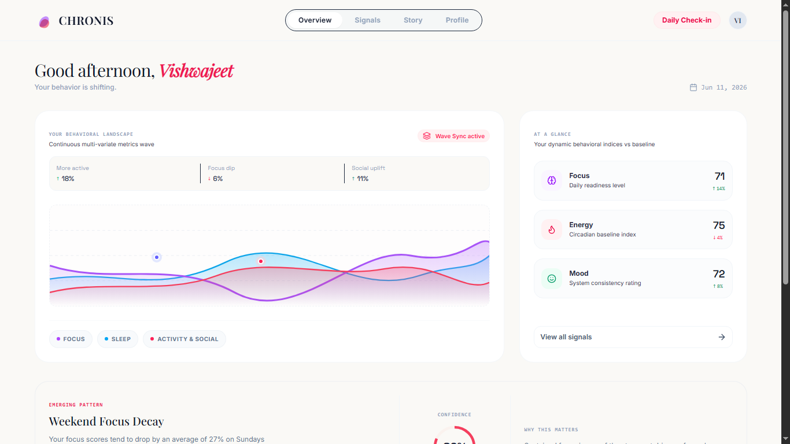
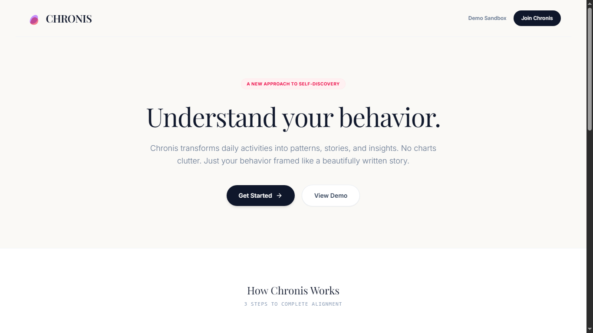
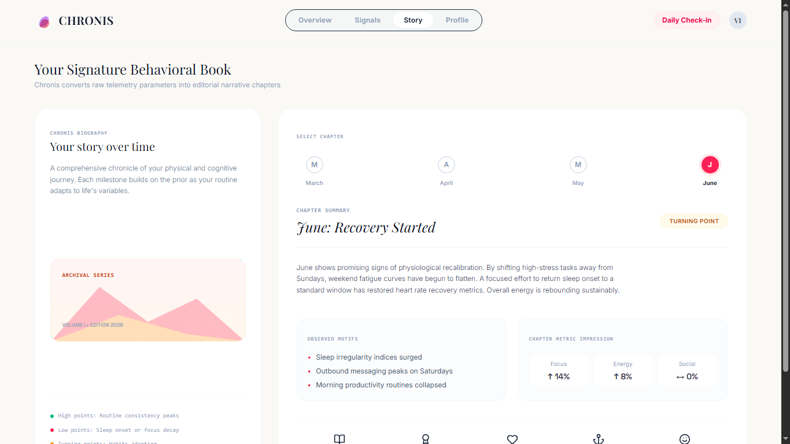

# Chronis — Product & App Engineer Prototype Walkthrough

This repository contains the end-to-end interactive user experience prototype for Chronis, built in React and Tailwind CSS. The interface is optimized to allow a user to explore behavioral trends, evidence validation logs, data uncertainty parameters, and historical timelines.

# Deployed app - https://chronis-assignment.vercel.app/

## Core Prototype Features

### 1. Dashboard Segment
- **Behavioral Snapshot**: Illustrates Alex's consistency scores (dynamically updating with 7D, 30D, and 90D presets). Houses responsive SVG sparklines and negative/positive influence attributions.
- **Interactive Multi-Variable Trend Chart**: Renders vector paths representing Sleep, Activity, Focus, and Social Balance. Hovering over coordinates reveals precise status logs. Clicking metrics spotlight corresponding lines with opacity transitions.
- **Confidence Diagnostics**: Displays three circular SVG gauges signifying Data Density levels (80% High, 15% Medium, 5% Low) synchronized with the active date limits.
- **Recent Shifts**: Surfaces significant variations (e.g. Sleep offset gains, screen drops).

### 2. Insight Explorer Segment
- **Sun Rising Over Dunes Graphic**: Elegant custom vector backdrop on cream canvas representing physical clarity.
- **Multi-Tab Workspace**:
  - **Overview**: Combines written explanations with high-fidelity weekly bar graphs highlighting anomalous weekend drops. Relates checklist items directly to active wearable metadata.
  - **Evidence Validation**: Tabulates historically confirmed weekend offsets week-by-week.
  - **Sparsity Explanations**: Details why focus ranges have a Medium Confidence label due to late Sunday logs gaps.
  - **Related Vectors**: Connects multiple insights in-place. Clicking nodes re-adjusts active insights without reloading.

### 3. Narrative Timeline Segment
- **River Winding Through Mountains Graphic**: Minimal background reflecting temporal progression over seasons.
- **Split Views Selector**: Swaps between consecutive row tracks (Timeline) and a granular density layout (Calendar).
- **Interactive Filtering & Panning**: Dropdowns refine displayed tracks by categories. Bottom scroll controls support real-time coordinate shifts. Selecting cards on the tracks focuses and loads that specific metric in the Explorer.

---

## Local Run Instructions

To install and initialize this application locally:

1. Clone or unpack the workspace repository.
2. Direct your terminal to the root folder:
   ```bash
   npm install
   ```
3. Boot the development system:
   ```bash
   npm run dev
   ```
4. Access the server by forwarding to:
   ```
   http://localhost:3000
   ```
5. Compilation checks:
   ```bash
   npm run build
   ```

   # Overview page- 
  


  # Landing page -
  


  # Story page-
  
